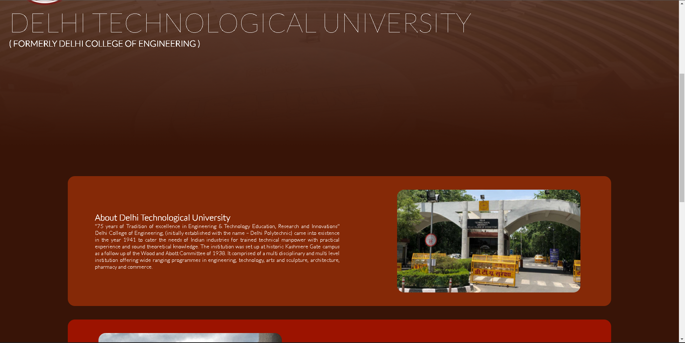
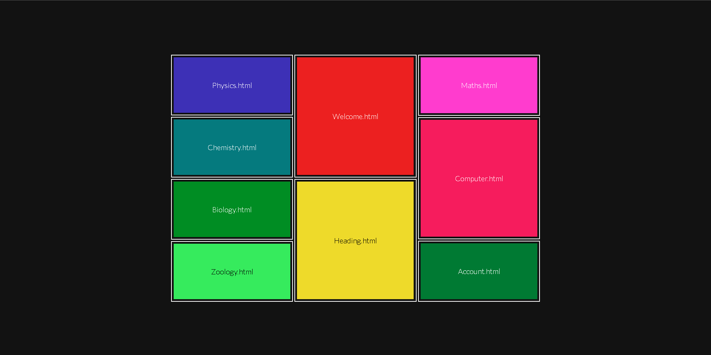

# Web Technology (CO 427) Lab Experiments
This repository contains the experiments in the course of the subject Web Technology (CO 427) for 7th semester, DTU  
Please go into the respective folders to get the code. I'm adding the screenshots of the outputs in here  
Also, please change the code at your end suitably to avoid plag detection :)
- ## Experiment 1
    Create a webpage with HTML describing your department. Use paragraph and list tags.  
    
- ## Experiment 2
    Apply various colours to suitably distinguish key words. Also apply font styling like italics, underline and two other fonts to words you find appropriate. Also use header tags.
    
- ## Experiment 3
    Insert an image and create a link such that clicking on image takes user to other page. Change the background colour of the page. At the bottom create a link to take user to the top of the page.
    
    
- ## Experiment 4
    Design a single page web site for a university containing a description of the courses offered, it should also contain some general information about the university such as its history, the campus and its unique features the page should be coloured and each section should have different colour
    
    
    
- ## Experiment 5
    Design page that has 5 equal columns the table should look the same in all screen resolution.
    
    
- ## Experiment 6
    | Which is your favourite color? | Who is your national leader? | Who is the highest test centuries person in India? |
    | -------------------------------|------------------------------|----------------------------------------------------|
    |Red|Sardar Patel|Kapil Dev|
    |Green|Gandhiji|Sachin Tendulkar|
    |Yellow|Indiraji|Sunil Gawaskar|
    |Blue|Nehruji|Ajay Jadeja|

Write a HTML code for making table to containing different option for different questions:

- ## Experiment 7
    Write the Frameset tags and Frame tags for the following frameset:
    
- ## Experiment 8
    Write html code to preview unordered list
    
- ## Experiment 9
    Make a simple registration form
    
- ## Experiment 10
    Write a HTML code to generate the following output:
    
- ## Experiment 11
    Create a web page of your college with following specifications. Place your College name at the top of the page in large text followed by address in smaller size. Add names of courses offered each in a different colour, style and typeface. Add scrolling text with a message of your choice Add college image at the bottom.
    
    
    
- ## Experiment 12
    Write a HTML code to generate following output:
    
- ## Experiment 13
    Write a HTML code to generate the following output:
    a0+a1x+a2x2+a3x3
    
- ## Experiment 14
    Write a HTML code to generate following output:
    
- ## Experiment 15
    Create a simple form to submit user input like his name, age, address and favorite subject. Put validation checks on values entered by the user using JavaScript (such as age should be a value between 1 and 150).
    
- ## Experiment 16
    Write a JavaScript program to display information box as soon as page loads.
        
    
